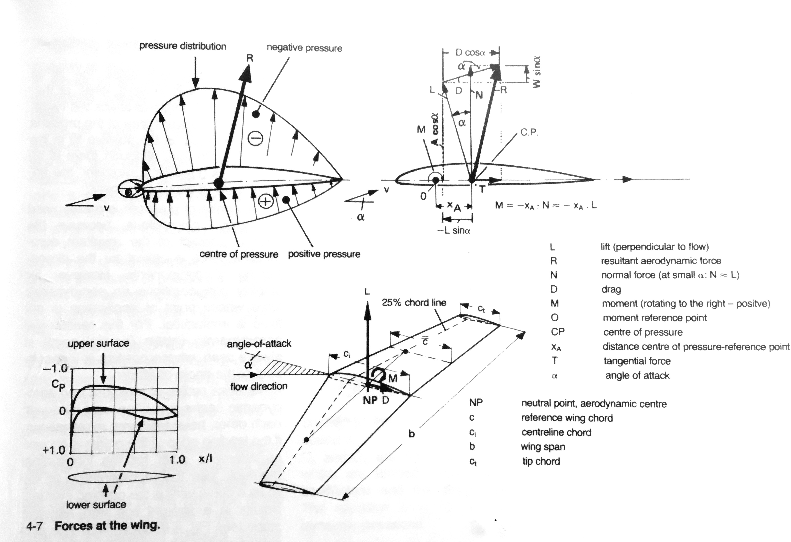

# DMCWingWorks

## Overview

This Swift package implements a 2-dimensional gas particle simulation.  It aims to show how, colliding randomly with one another and with an airfoil shape, gas particles can produce lift and drag on an airfoil.

The package defines three products.

The `DMCWingWorks` library models collisions between particles and polygons in a 2-dimensional space.

The `DMCWingWorksRender` library creates Quicktime movies showing how the simulation evolves over time.

The `DMCWingWorksSim` command line executable shows how these libraries can be used to run and record a simulation.

*`DMC` is meant to reduce the likelihood of name collisions with other Swift packages.  It's short for "[Desert Moon Consulting](https://dmoonc.com)," my software consulting LLC.*

## Motivation

> Physical laws ordain that the air flowing over the top of the wing must reach the back of the wing (the trailing edge) at the same time as air flowing under the wing.  The curvature of the wing forces air to travel farther across the top surface than across the bottom.  In order to travel the longer distance in the same amount of time, the air passing over the top of the wing must flow faster than the air flowing underneath the wing.  This faster-moving air results in lower air pressure above the wing than below.  The net result is lift...

-- The Sibley Guide to Bird Life & Behavior

> The airfoil on the Lockheed F-104 straight-wing supersonic fighter is a thin, **symmetric** airfoil with a thickness ratio of 3.5 percent.

-- Introduction to Flight, 7th Edition (emphasis added)

## This Air Isn't Travelling

Imagine you are an average air molecule on a calm, cool morning.  You're just sitting there, about a meter above the ground, minding your own business.  You are bouncing around a bit; you have a lot of companions, and they're all bumping into one another, and into you.

All of a sudden something big and solid slams into you from the side.  You rebound upward, smacking hard into one of your neighbors, who bounces you back downward, but not quite as fast as you'd been moving upward.  After a while you hit the object again.  This time it's more of a sideways collision, without so much upward force.

All of your companions got hit.  Some of those below you bounced multiple times, downwards, as the object passed.  Hit, slam down, bounce upward off the neighbors, slam down again, and so on.

You weren't "traveling" anywhere.  You were simply minding your own business when you and your neighbors all got smacked.

You are an average air molecule, on a calm day, hanging just above the runway of a small airport.  You have just collided with an airplane wing.

## A Slightly More Useful Explanation

It's pretty meaningless to explain lift by stating that faster moving air has lower pressure than slower moving air. If you happen to be a sheet of plywood that gets hit broadside by that fast-moving air, you'd surely perceive it as exerting a lot more pressure than slower-moving air.

Sibley's description may be derived from, say, Bernoulli's experiments.  But it has lost the meaning of the original.

It seems more useful to ***think in terms of particles being forced out of the way by a wing and*** to think about how they are deflected in aggregate - about the resulting ***reactive forces*** on the surfaces of a wing.

Like me you may have been taught that lift isn't a result of the direct impact of air onto a flat surface, but that it's all about the shape of the airfoil.  Yet a box kite, presenting only flat surfaces to the wind, can fly.  Your hand, sticking out a car window, can be lifted up forcefully by the air that it hits.

Shape isn't *everything*: you get lift from a flat plate, as long as you angle it correctly relative to the wind.  In other words, angle of attack also matters.

When you fly a light airplane you get a practical sense of the influence of angle of attack.  You start your roll down the runway with minimal back pressure on the yoke that (if you're flying a conventional airplane with a horizontal stabilizer + elevator in the back) controls the deflection angle of the elevator.  You accelerate to rotation speed, a speed at which the upward-angled elevator can generate enough downward force to lever the tail of the airplane down toward the ground.

The rotation of the fuselage also rotates the wing, changing its orientation with respect to the air through which it's moving.  Now its bottom surface hits the wind much like your hand did when it stuck out the car window.  That's when the wing really starts generating lift.  A fair fraction of that lift comes from displacing air downward - from direct pressure, just like your hand felt.

If you rotate too much, the wing behaves more like a flat plate turned broadside to the wind, with most of the force pushing the wing backward rather than upward, and with air swirling in its wake.  Angle of attack matters: a wing generates lift, without too much drag, within a fairly narrow range of angles.

## Coherent Explanations

["Stick and Rudder"](https://www.amazon.com/Stick-Rudder-Explanation-Art-Flying/dp/0070362408/ref=sr_1_1?crid=FTXBL8MKUT58&keywords=stick+and+rudder+by+wolfgang+langewiesche&qid=1638032707&sprefix=stick+and+rudder%2Caps%2C213&sr=8-1) by Wolfgang Langewiesche (ISBN-13 978-0070362406), describes all of this better than I can.

Another good source is ["Modern Combat Aircraft Design"](https://www.amazon.com/Modern-Combat-Aircraft-Design-English/dp/0870214268/ref=sr_1_1?qid=1638032824&refinements=p_27%3AKlaus+Huenecke&s=books&sr=1-1&text=Klaus+Huenecke) by Klaus Huenecke, the English version of which (ISBN 087021-426-8) provided the images above.